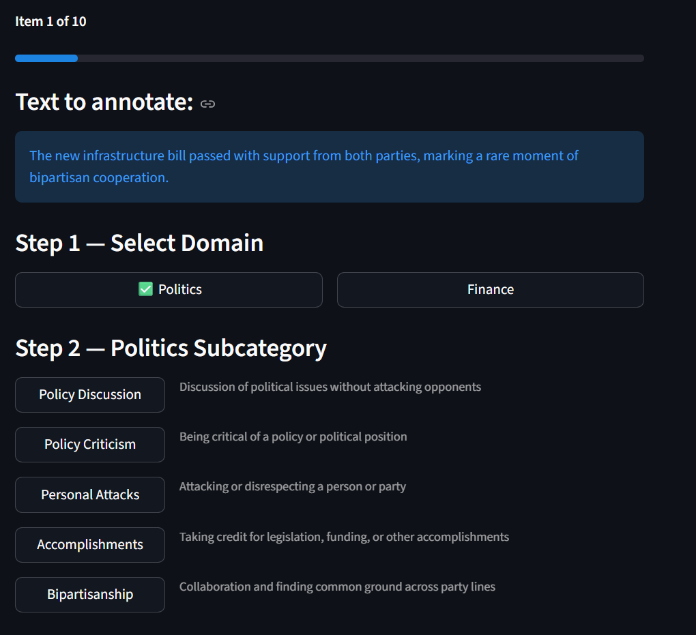
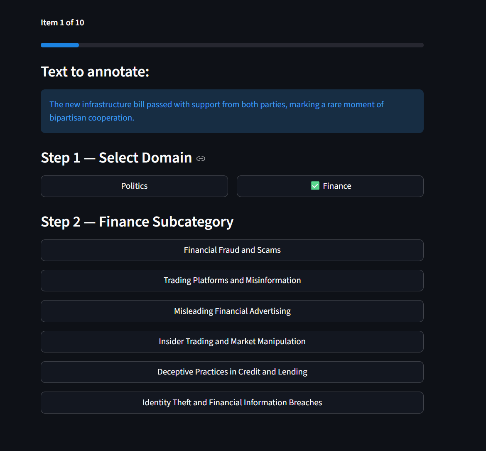

# Misinformation Domain Annotation Tool

A Streamlit-based annotation tool for classifying text items by misinformation domain (Politics or Finance) and subcategory. Designed for multi-annotator studies via [Prolific](https://www.prolific.com/), with automatic per-annotator assignment and output.

---

## Screenshots

| Politics view | Finance view |
|---|---|
|  |  |

---

## How it works

1. Each annotator arrives via a URL containing their Prolific ID (e.g. `?PROLIFIC_PID=abc123`)
2. They are automatically assigned up to **10 rows** from your CSV that still need annotations
3. For each item they select a **domain** (Politics or Finance) and a **subcategory**
4. Their annotations are saved to a file named `annotations_{prolific_id}.csv`, containing all original CSV columns plus `row_id`, `prolific_id`, `domain`, and `subcategory`
5. Rows are filled to **3 annotations each** before new rows are opened up

---

## Input CSV format

The CSV must have a column named one of: `text`, `note`, `message`, `content`, or `post`. All other columns are preserved in the output. A minimal example:

```csv
text
"The new infrastructure bill passed with bipartisan support."
"A fake trading platform promised 30% monthly returns."
```

A sample file (`data.csv`) with 10 rows is included in this repo for testing.

---

## Local setup

**1. Clone the repository**
```bash
git clone https://github.com/kokiljaidka/annotation_ui.git
cd annotation_ui
```

**2. Install dependencies**
```bash
pip install -r requirements.txt
```

**3. Run the app**
```bash
streamlit run annotation_script.py
```

Or use the included shell script:
```bash
chmod +x run_app.sh
./run_app.sh
```

The app opens at `http://localhost:8501`.

---

## Testing locally with multiple annotators

Simulate different Prolific annotators by opening separate browser tabs with different `PROLIFIC_PID` values:

```
http://localhost:8501/?PROLIFIC_PID=user_1
http://localhost:8501/?PROLIFIC_PID=user_2
http://localhost:8501/?PROLIFIC_PID=user_3
```

Each annotator will be assigned a different set of rows. After annotating, check the output files:

```
annotations_user_1.csv
annotations_user_2.csv
annotations_user_3.csv
```

`assignments.json` is also created automatically to track which rows have been assigned and how many annotations each row has received — do not delete it mid-study.

---

## Hosting on the web

### Option 1 — Streamlit Community Cloud (free, easiest)

1. Push this repo to GitHub (already done)
2. Go to [share.streamlit.io](https://share.streamlit.io) and sign in with GitHub
3. Click **New app**, select this repo and `annotation_script.py`
4. Deploy — you'll get a public URL like `https://yourapp.streamlit.app`
5. In your Prolific study, set the study URL to:
   ```
   https://yourapp.streamlit.app/?PROLIFIC_PID={}
   ```
   Prolific will substitute `{}` with each participant's real ID automatically.

> **Note:** Streamlit Community Cloud has ephemeral storage — files written during the session (CSVs, `assignments.json`) are lost on restart. Use the sidebar export button to download results regularly, or switch to Option 2/3 for persistent storage.

---

### Option 2 — Railway or Render (free tier, persistent storage)

Both [Railway](https://railway.app) and [Render](https://render.com) support persistent disks and are straightforward to set up.

**Railway:**
1. Connect your GitHub repo at [railway.app](https://railway.app)
2. Set the start command to `streamlit run annotation_script.py --server.port $PORT --server.address 0.0.0.0`
3. Add a persistent volume mounted at `/app` so CSV files survive restarts
4. Use the public Railway URL in your Prolific study with `?PROLIFIC_PID={}`

**Render:**
1. Create a new **Web Service** from your GitHub repo at [render.com](https://render.com)
2. Set the start command to `streamlit run annotation_script.py --server.port 10000 --server.address 0.0.0.0`
3. Add a persistent disk mounted at `/app`

---

### Option 3 — Your own server (most control)

```bash
# On the server
git clone https://github.com/kokiljaidka/annotation_ui.git
cd annotation_ui
pip install -r requirements.txt
streamlit run annotation_script.py --server.port 8501 --server.address 0.0.0.0
```

Use [nginx](https://nginx.org) as a reverse proxy and [Let's Encrypt](https://letsencrypt.org) for HTTPS. Then point your Prolific study URL to `https://yourdomain.com/?PROLIFIC_PID={}`.

---

## Output

Each annotator produces one CSV file:

| Column | Description |
|--------|-------------|
| *(original columns)* | All columns from your input CSV |
| `row_id` | Row index from the input CSV |
| `prolific_id` | Annotator's Prolific ID |
| `domain` | `politics` or `finance` |
| `subcategory` | One of the subcategory values listed below |

### Subcategories

**Politics:** `policy_discussion`, `policy_criticism`, `personal_attacks`, `accomplishments`, `bipartisanship`

**Finance:** `financial_fraud`, `trading_misinformation`, `misleading_advertising`, `insider_trading`, `deceptive_lending`, `identity_theft`
